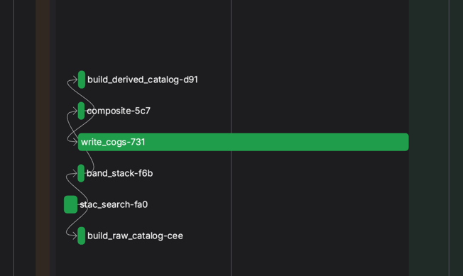
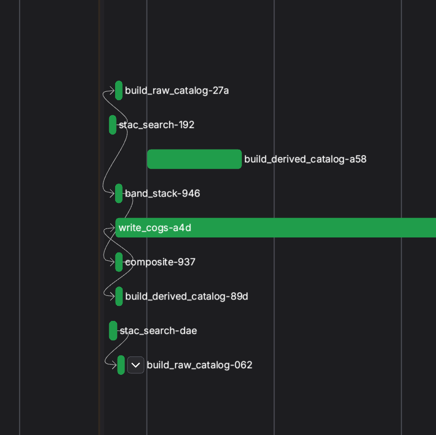

# Steps to Run the Project

## Overview

This guide will walk you through setting up and running the project.

## Developer Notes

## PS

## 🔧 Additional Notes

Important URL : 
prefect:
 PREFECT_API_URL = http://127.0.0.1:4200/api
 Dashboard: http://127.0.0.1:4200/dashboard
makefile set this (please make sure it is running on 4200)

DASK dashbord : logged in the message

- 🚗 **STAC API Source:**  
  Configurable via `config.py`. Currently uses Landsat imagery for demonstration.

- ☁️ **Production Setup (Recommended):**  
  Raw files should be stored in S3/GCS, with STAC metadata indexed in PostGIS.

- 💻 **Local Run:**  
  Tested on a Mac M1 with minimal memory; works well for small to medium AOIs.

- 📁 **Output Directory:**  
  Processed data is saved in the `data/` directory (configurable via `config.py`).

- 🗃️ **Catalog Storage (Planned):**  
  Future versions will persist STAC metadata to PostGIS for easier querying.

- ⏱️ **Performance:**  
  Processing ~19 assets with pre-fetched data takes ~1.5 minutes.

- 📊 **Monitoring:**  
  Use the Dask dashboard to monitor task execution, memory usage, and performance.

- 🚀 **Ray Support (Optional):**  
  Architecture supports swapping in Ray for tasks requiring fine-grained parallelism.

- 📓 **Sample Analysis:**  
  See included Jupyter notebooks for band stacking examples and visualizations.

## Prerequisites 

1. [ ] **Python "^3.10"**: Ensure that Python is installed on your machine. 

2. [ ] **Poetry**: This project uses [Poetry](https://python-poetry.org/) for dependency management. 


## Setup Instructions 

1. **Install Poetry**

   If you don't have Poetry installed, you can install it using pip:

   ```bash
   pip install poetry
    ```

   ```bash
   poetry install
   

## 2. Steps to Run the Project
### Prerequisites

Before running the pipeline, ensure you have the following installed:
1. [ ] Poetry (for dependency management)
2. [ ] Python "^3.10" (Used: Python 3.10.6) # can leverage pyenv

The project’s configuration is centralized in two key files: `config/config.py` and `config/settings.py`. These files are crucial for defining settings like file paths, batch sizes, and other environment-specific variables.

```html

```html
## Configuration Overview

- **config/config.py**  
  - Sets project root and data directories (raw, interim, processed).  
  - Defines Parquet file paths and schema with PyArrow.

- **config/settings.py**  
  - Configures Ray (CPU count, spill directory, object store memory).  
  - Sets Dask worker parameters (memory limits, worker count) and model/inference settings.

These files centralize environment-specific settings (e.g., file paths, batch sizes) for easy customization and consistent project behavior.

```

### 1. Running the Pipeline Using Makefile
Makefile simplifies execution by managing dependencies and execution order.

## 1. Running the Pipeline Using Makefile
Makefile simplifies execution by managing dependencies and execution order.

### 1.1 make help : 
```bash
 make help
====================================================
                Available Make Targets

====================================================

```
### 1.2 Run End to End (FASTAPI->PREFECT->TRIGGERDASK)

```bash
 make start
<details> <summary><b>Execution Log (Click to Expand)</b></summary>

```angular2html

make start
[MAKE] Using:
       PREFECT_API_URL = http://127.0.0.1:4200/api
       FASTAPI_HOST    = 127.0.0.1
       FASTAPI_PORT    = 8000
       MAX_TRIES       = 3
       SLEEP           = 5
       LOG_DIR         = logs
[1/5] Starting Prefect server…
    → PID 89781, logs → logs/prefect_server.log
[2/5] Waiting for Prefect API at http://127.0.0.1:4200/apicurl: (7) Failed to connect to 127.0.0.1 port 4200 after 0 ms: Couldn't connect to server
 (retry 1/3 in 5s) ✅
[3/5] Launching Prefect flow (eo_monthly_mosaic)…
    → PID 89883, logs → logs/flow.log
[4/5] Checking port 8000 for existing process…
    → Port 8000 is free
[5/5] Starting FastAPI at http://127.0.0.1:8000…
    + poetry run uvicorn api:app --host 127.0.0.1 --port 8000 --reload
INFO:     Will watch for changes in these directories: ['/Users/bikash/MyASSIGNMENTS/eo']
INFO:     Uvicorn running on http://127.0.0.1:8000 (Press CTRL+C to quit)
INFO:     Started reloader process [89779] using StatReload


```
</details>
====================================================
One this is up 
you Should be able to access prefect dashboard: http://127.0.0.1:4200/dashboard


### 1.3 : It is time to hit the api
Go to Terminal
For single asset and no parralel run pass one aoi
```bash
 curl -X POST http://127.0.0.1:8000/run \
  -H "Content-Type: application/json" \
  -d '{
        "bboxes": [[-122.6, 37.5, -122.3, 37.9]],
        "toi":    "2024-06-01/2024-06-30",
        "bands":  ["red","green","blue"]
      }'
```

Multiple AOI will spawn multiple run on same Dask cluster

```bash
curl -X POST http://127.0.0.1:8000/run \                   
  -H "Content-Type: application/json" \
  -d '{
        "bboxes": [
          [-122.6, 37.5, -122.3, 37.9],
          [-123.0, 38.0, -122.7, 38.4]
        ],
        "toi": "2024-06-01/2024-06-30",
        "bands": ["red","green","blue"]
      }'

```
Response from prefect
``{"flow_run_id":"97170396-32c9-4fb0-b785-4adaff8ebc7c","state":"SCHEDULED"}% ``


### 1.3 : It is time to run locally in debug mode (My Fav)

```bash

python run main.py
```


## Some Screenshots  (RUN)

## flow


### Single Run 



### for multiple (based on number of AOI we see parallel task) (below 2 aoi 2 identical job)




## Improvement (I can work on it)

1. Could have made Prefect more dynamic in terms of api address
2. Test case
3. Variable name 
4. Missing dedicate Struct log
5. Some example how to query that stac api (but I can prepare)
